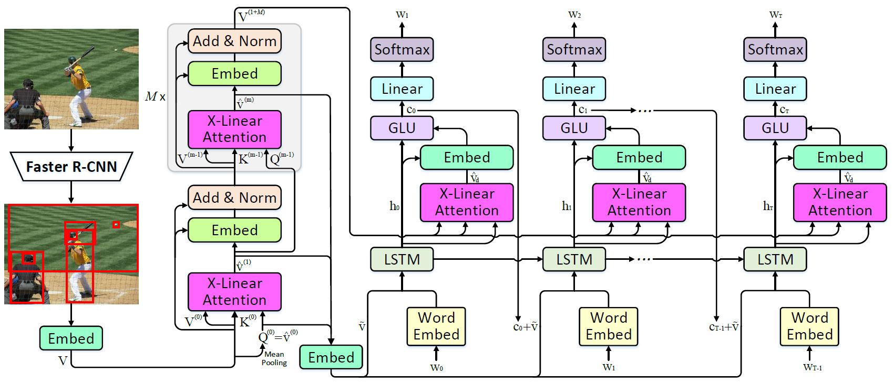

# Introduction
This repository is for **X-Linear Attention Networks for Image Captioning** (CVPR 2020). The original paper can be found [here](https://arxiv.org/pdf/2107.12292.pdf).

Please cite with the following BibTeX:

```
@inproceedings{xlinear2020cvpr,
  title={X-Linear Attention Networks for Image Captioning},
  author={Pan, Yingwei and Yao, Ting and Li, Yehao and Mei, Tao},
  booktitle={Proceedings of the IEEE/CVF Conference on Computer Vision and Pattern Recognition},
  year={2020}
}
```

<p align="center">
  
</p>


## Requirements
* Python 3
* CUDA 10
* numpy
* tqdm
* easydict
* [PyTorch](http://pytorch.org/) (>1.0)
* [torchvision](http://pytorch.org/)
* [coco-caption](https://github.com/ruotianluo/coco-caption)

## Data preparation
1. Download the [bottom up features](https://github.com/peteanderson80/bottom-up-attention) and convert them to npz files
```
python2 tools/create_feats.py --infeats bottom_up_tsv --outfolder ./mscoco/feature/up_down_10_100
```

2. Download the [annotations](https://drive.google.com/open?id=1i5YJRSZtpov0nOtRyfM0OS1n0tPCGiCS) into the mscoco folder. More details about data preparation can be referred to [self-critical.pytorch](https://github.com/ruotianluo/self-critical.pytorch)

3. Download [coco-caption](https://github.com/ruotianluo/coco-caption) and setup the path of __C.INFERENCE.COCO_PATH in lib/config.py

4. The pretrained models and results can be downloaded [here](https://drive.google.com/open?id=1a7aINHtpQbIw5JbAc4yvC7I1V-tQSdzb).

5. The pretrained SENet-154 model can be downloaded [here](https://drive.google.com/file/d/1CrWJcdKLPmFYVdVNcQLviwKGtAREjarR/view?usp=sharing).

## Training
### Train X-LAN model
```
bash experiments/xlan/train.sh
```

### Train X-LAN model using self critical
Copy the pretrained model into experiments/xlan_rl/snapshot and run the script
```
bash experiments/xlan_rl/train.sh
```

### Train X-LAN transformer model
```
bash experiments/xtransformer/train.sh
```

### Train X-LAN transformer model using self critical
Copy the pretrained model into experiments/xtransformer_rl/snapshot and run the script
```
bash experiments/xtransformer_rl/train.sh
```

## Evaluation
```
CUDA_VISIBLE_DEVICES=0 python3 main_test.py --folder experiments/model_folder --resume model_epoch
```

## Acknowledgements
Thanks the contribution of [self-critical.pytorch](https://github.com/ruotianluo/self-critical.pytorch) and awesome PyTorch team.
